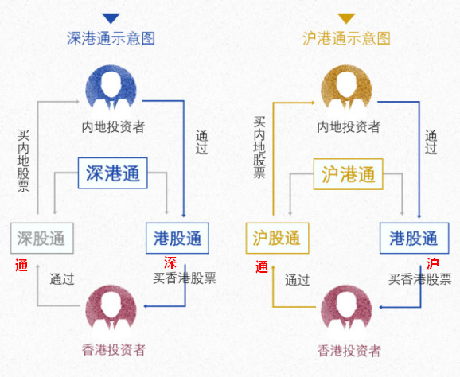

## Linux 客户端标志含义

**A**:A股
**B**:B股
**H**:H股
**R**:可融资、融券
**Q**:小公募债券
**AB**:同时发行A股、B股
**AH**：同时发行A股、H股
**◇**: 资讯
**||**:股票前缀 11查看
港股通  客户端快捷键：**571**
**沪**：沪港通，可在上交所买卖的港股
**深**：深港通，可在深交所买卖的港股 
**通**：沪港通{沪股通,深股通}
沪股通，可在港交所买卖的沪股 客户端快捷键：**504068**
深股通，可在港交所买卖的深股 客户端快捷键：**504138**

解释：
应该在沪深代码看到 '通'
应该在港股代码看到 '沪'或者'深'

问题：
关于显示不准确的问题原因是龙讯更新的标志文件不正确或者不及时
/opt/qianlong/syscfg/commark.ini
/opt/qianlong/client/lonld/cfg/commark.ini
拿到正确文件更新后，重启客户端即可

注意：网上交易与场内标志逻辑不同，所以显示有区别
